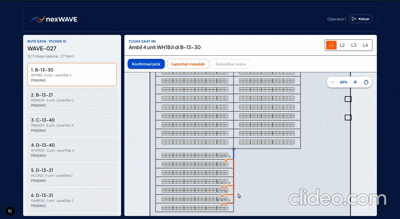

<p align="center">
	
</p>

<p align="center">
	<strong>Warehouse Operations Control</strong><br/>
	Intelligent order batching + picker routing in one operational dashboard.
</p>

<p align="center">
	
	
	
	
	
</p>

# nexWAVE

Repositori ini berisi sistem operasional warehouse end-to-end:

- Frontend web untuk manager dan operator (Next.js + Supabase)
- Backend ML/API (FastAPI di Modal) yang sudah dideploy
- Dataset dummy dan skrip backend pendukung

## Catatan Struktur Repository

Pengerjaan backend/AI dan frontend nexWAVE dilakukan secara terpisah melalui dua repository:

- Backend/AI: https://github.com/febryannnn/nexwave-backend
- Frontend: https://github.com/ahmdlka/nexWave-Frontend

Kedua repository tersebut saling terhubung melalui API backend yang telah dideploy. Untuk menjalankan aplikasi frontend secara lokal, cukup gunakan repository frontend dan konfigurasi environment sesuai petunjuk di bawah. Backend tidak perlu dijalankan secara lokal karena layanan backend untuk demo sudah dideploy.

Tujuan dokumen ini adalah membantu juri menjalankan dan memahami proyek secara lokal, khususnya aplikasi frontend dan integrasinya dengan layanan backend/AI.

## Quick Start (Juri)

```bash
git clone https://github.com/ibrahimferel/nexWAVE-Product.git
cd nexWAVE-Product
cd nexWave-Frontend
cp .env.example .env
# lengkapi .env dengan secret yang sudah dibagikan
npm install
npm run dev
```

Lalu buka http://localhost:3000

## Gambaran Singkat Proyek

nexWAVE menggabungkan dua alur utama operasional gudang:

- Order batching: pengelompokan order ke wave
- Picker routing: rute pengambilan barang untuk operator/picker

Peran pengguna:

- Manager: melihat dashboard operasional, wave aktif, dan ringkasan shift
- Operator: menjalankan checklist picking berdasarkan rute

Arsitektur eksekusi:

- Frontend berkomunikasi ke Supabase untuk auth dan operasi data utama
- Backend Modal dipakai untuk endpoint ML/aksi tertentu (contoh: close wave, process pending orders)

Backend sudah dideploy di:

- https://farelfebryan06--nexwave-api-fastapi-app.modal.run

## demo-nexWAVE

Bagian ini disiapkan agar juri cepat memahami bagaimana mencoba sistem.

<p align="center">
	
</p>

| Item Demo | Keterangan |
|---|---|
| Akses aplikasi | Jalankan lokal dari `nexWave-Frontend/` |
| URL lokal | `http://localhost:3000` |
| Login manager | Google OAuth (akun yang sudah didaftarkan) |
| Login operator | Email/password dummy (7 akun, lihat daftar kredensial di bawah) |
| Fitur kunci yang didemokan | Monitoring wave aktif, checklist picking, close wave, process pending orders |
| Backend deploy | `https://farelfebryan06--nexwave-api-fastapi-app.modal.run` |

### Kredensial Operator (7 Akun Dummy)

Kredensial password fixed `pickerN`, sama setiap dijalankan:

| Operator | Email | Password |
|---|---|---|
| Operator 1 | operator1@nexwave.local | picker1 |
| Operator 2 | operator2@nexwave.local | picker2 |
| Operator 3 | operator3@nexwave.local | picker3 |
| Operator 4 | operator4@nexwave.local | picker4 |
| Operator 5 | operator5@nexwave.local | picker5 |
| Operator 6 | operator6@nexwave.local | picker6 |
| Operator 7 | operator7@nexwave.local | picker7 |

Checklist skenario demo yang direkomendasikan:

1. Login sebagai manager dan buka dashboard wave aktif.
2. Login sebagai operator untuk menjalankan picking route.
3. Konfirmasi pick beberapa lokasi lalu cek update realtime di sisi manager.
4. Tutup wave dan lihat assignment wave berikutnya.
5. Trigger process pending orders (opsional) untuk simulasi order due.

## Struktur Folder Penting

- `nexWave-Frontend/` -> aplikasi frontend yang dijalankan lokal
- `nexwave-backend/` -> source backend dan aset pendukung (tidak wajib dijalankan lokal untuk demo frontend)

## Cara Menjalankan (Untuk Juri)

Ikuti langkah berikut dari parent folder repositori ini.

### 1) Clone repository

```bash
git clone https://github.com/ibrahimferel/nexWAVE-Product.git
cd nexWAVE-Product
```

### 2) Masuk ke folder frontend

```bash
cd nexWave-Frontend
```

### 3) Pastikan prasyarat

- Node.js versi 20.9 atau lebih baru
- npm tersedia

Cek cepat:

```bash
node -v
npm -v
```

### 4) Install dependency

```bash
npm install
```

### 5) Siapkan environment

Langkah ini wajib sebelum menjalankan aplikasi.

Salin template environment yang sudah disediakan:

```bash
cp .env.example .env
```

Lalu isi semua variabel di `.env` menggunakan kredensial/secret yang sudah diberikan:

```env
NEXT_PUBLIC_SUPABASE_URL=...
NEXT_PUBLIC_SUPABASE_ANON_KEY=...
NEXT_PUBLIC_API_BASE_URL=https://farelfebryan06--nexwave-api-fastapi-app.modal.run
```

Catatan:

- `NEXT_PUBLIC_SUPABASE_URL` dan `NEXT_PUBLIC_SUPABASE_ANON_KEY` wajib
- `NEXT_PUBLIC_API_BASE_URL` disarankan aktif agar fitur endpoint backend dapat dipakai
- Jangan biarkan nilai placeholder (misalnya `isi-dengan-...`) tetap ada di file `.env`
- Setiap perubahan file env memerlukan restart development server

Tip: nilai awal contoh ada di `.env.example`, tetapi wajib diganti dengan secret asli sebelum aplikasi dijalankan.

### 6) Jalankan development server

```bash
npm run dev
```

Buka:

- http://localhost:3000

Jika port 3000 sudah dipakai:

```bash
npm run dev -- -p 3001
```

### 7) (Opsional) Validasi cepat

```bash
npm run lint
npm run test
```

## Alur Login

- Manager: login via Google OAuth
- Operator: login via email/password akun dummy (7 akun pada tabel kredensial di atas)

Setelah login, user diarahkan sesuai role ke dashboard manager/operator.

## Catatan Demo

- Untuk kebutuhan demo penutupan wave dan pemrosesan pending orders, frontend akan menggunakan backend URL di `NEXT_PUBLIC_API_BASE_URL`.
- Operasi data lain yang berbasis Supabase tetap membutuhkan konfigurasi Supabase yang valid (sudah disiapkan melalui secret yang dibagikan).

## Troubleshooting Singkat

- Error `supabaseUrl is required`:
	- Pastikan `.env` sudah dibuat dari `.env.example`
	- Pastikan semua nilai placeholder sudah diganti dengan secret yang valid
	- Restart dev server setelah mengubah env
- `EBADENGINE` saat `npm install`:
	- Update Node.js ke >= 20.9
- Login berhasil tapi data kosong:
	- Pastikan kredensial Supabase dan data project sesuai environment demo
